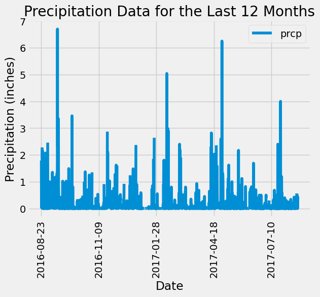
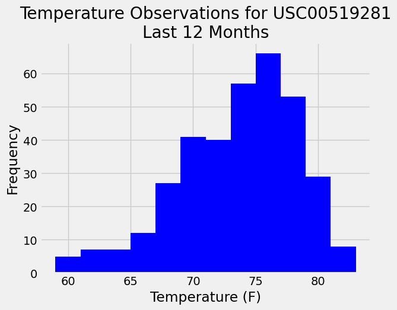

# SQLAlchemy_challenge

Climate analysis about Honolulu, Hawaii.

## Part 1: Analyze and Explore the Climate Data

I've used Python and SQLAlchemy to do a basic climate analysis and data exploration of the climate database. Specifically, I've used SQLAlchemy ORM queries, Pandas, and Matplotlib.

### Precipitation Analysis (Instructions)

* Find the most recent date in the dataset. Using that date, get the previous 12 months of precipitation data by querying the previous 12 months of data. Select only the "date" and "prcp" values. Load the query results into a Pandas DataFrame. Sort the DataFrame values by "date". Plot the results by using the DataFrame plot method.

* Use Pandas to print the summary statistics for the precipitation data.

### Station Analysis (Instructions)

* Design a query to calculate the total number of stations in the dataset. Design a query to find the most-active stations, then list the stations and observation counts in descending order. Design a query that calculates the lowest, highest, and average temperatures that filters on the most-active station id found in the previous query. Design a query to get the previous 12 months of temperature observation (TOBS) data and plot the results as a histogram with bins=12.

## Part 2: Design Your Climate App

I have desiged a Flask API based on the queries just developed

* @app.route("/") 

Start the homepage. List all the available routes:

* @app.route("/api/v1.0/precipitation") 

Precipitation analysis from the last 12 months of data.

* @app.route("/api/v1.0/stations") 

Return a JSON list of stations from the dataset.

* /api/v1.0/tobs (Query the dates and temperature observations of the most-active station for the previous year of data. Return a JSON list of temperature observations for the previous year.)

* @app.route('/api/v1.0/<start>') 

Define the temperature statistics route for a specified start date. Return a JSON list of the minimum temperature, the average temperature, and the maximum temperature for a specified start date.

* @app.route("/api/v1.0/<start>/<end>")

Perform a query to retrieve MIN, AVG, and MAX for all dates between start and end date, inclusive.

NOTE : I have worked with our TA for the API Dynamic Routes. Also, worked with LR for cleaning the code to perform a query to retrieve the data and precipitation scores.
